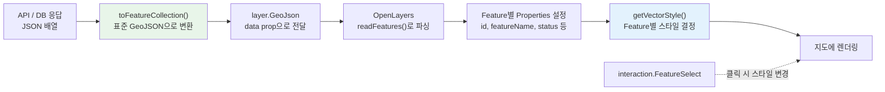
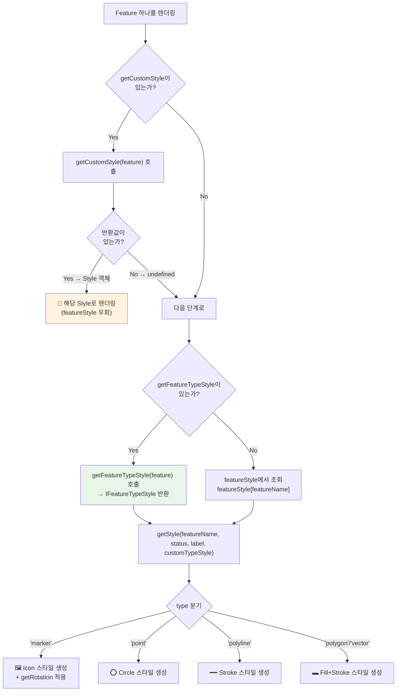

# 📘 layer.GeoJson 컴포넌트 개발자 가이드

> xc-map 라이브러리에 새로 추가된 `layer.GeoJson` 컴포넌트의 **완전한 사용 가이드**입니다.
> 프론트엔드 개발자가 이 문서만으로 GeoJson 레이어를 구현할 수 있도록 작성되었습니다.

---

## 목차

1. [GeoJson 컴포넌트란?](#1-geojson-컴포넌트란)
2. [기존 컴포넌트와의 비교](#2-기존-컴포넌트와의-비교)
3. [전체 데이터 흐름 (Big Picture)](#3-전체-데이터-흐름-big-picture)
4. [Step 1: 데이터 준비 — toFeatureCollection](#4-step-1-데이터-준비--tofeaturecollection)
5. [Step 2: 컴포넌트 배치](#5-step-2-컴포넌트-배치)
6. [Step 3: 스타일 설정 (핵심)](#6-step-3-스타일-설정-핵심)
7. [Step 4: 인터랙션 연동 (FeatureSelect)](#7-step-4-인터랙션-연동-featureselect)
8. [Props 전체 레퍼런스](#8-props-전체-레퍼런스)
9. [Imperative API (ref)](#9-imperative-api-ref)
10. [실전 예제: App.tsx 줄별 해설](#10-실전-예제-apptsx-줄별-해설)
11. [자주 묻는 질문 (FAQ)](#11-자주-묻는-질문-faq)

---

## 1. GeoJson 컴포넌트란?

### 한 줄 정의

> **로컬 GeoJSON 데이터를 지도에 표시하는 범용 벡터 레이어 컴포넌트**

### 왜 필요한가?

기존에 벡터 데이터를 지도에 표시하려면:
- **`layer.Marker`** → Point(점)만 가능. 서버 없이 로컬 데이터 사용.
- **`layer.Wfs`** → GeoServer WFS URL에서 데이터를 가져옴. 서버 필수.

하지만 이런 경우가 있습니다:
- ✅ 서버 없이 **로컬/API JSON 데이터**를 지도에 표시하고 싶다
- ✅ **선(LineString)이나 면(Polygon)**도 표시하고 싶다
- ✅ 같은 레이어에 **점 + 선이 섞여** 있다
- ✅ 같은 데이터 안에서 **종류별로 다른 아이콘**을 보여주고 싶다

→ 이 모든 것을 해결하는 것이 `layer.GeoJson` 입니다.

### 지원하는 지오메트리 타입

| 타입 | 설명 | 예시 |
|------|------|------|
| `Point` | 점 하나 | CCTV 위치, 신호등 위치 |
| `MultiPoint` | 점 여러개 | 관련 장비 그룹 |
| `LineString` | 선 하나 | 도로, 경로 |
| `MultiLineString` | 선 여러개 | 복잡한 도로 노면표시 |
| `Polygon` | 면 하나 | 구역, 영역 |
| `MultiPolygon` | 면 여러개 | 복잡한 구역 |

---

## 2. 기존 컴포넌트와의 비교

```
┌──────────────────────────────────────────────────────────────────┐
│                    xc-map 벡터 레이어 비교                         │
├──────────────┬───────────────┬───────────────┬──────────────────┤
│              │ layer.Marker  │  layer.Wfs    │  layer.GeoJson   │
├──────────────┼───────────────┼───────────────┼──────────────────┤
│ 데이터 소스   │ 로컬 배열      │ GeoServer URL │  로컬 GeoJSON    │
│ 지오메트리    │ Point만        │ 서버가 결정    │  전부 지원        │
│ 혼합 지오메트리│ ❌            │ 서버가 결정    │  ✅              │
│ 동적 아이콘   │ featureName별  │ featureName별 │  ✅ Feature별    │
│ FeatureSelect│ ✅            │ ✅            │  ✅              │
│ layerTag     │ ✅            │ ✅            │  ✅              │
└──────────────┴───────────────┴───────────────┴──────────────────┘
```

---

## 3. 전체 데이터 흐름 (Big Picture)



**핵심 흐름을 3단계로 요약하면:**

```
[1. 데이터 변환] → [2. 컴포넌트에 전달] → [3. 스타일 결정]
```

이제 각 단계를 하나씩 파헤쳐 보겠습니다.

---

## 4. Step 1: 데이터 준비 — toFeatureCollection

### 4.1 왜 변환이 필요한가?

우리 API에서 내려오는 데이터는 이렇게 생겼습니다:

```json
[
  {
    "id": "SM_001",
    "groupid": "surfacemark_direction",
    "signtype": "5371",
    "signtypenm": "직진",
    "angle": "38",
    "geom": "{\"type\":\"Point\",\"coordinates\":[126.730,37.363]}"
  },
  {
    "id": "SM_002",
    "groupid": "surfacemark_text",
    "signtype": "515",
    "signtypenm": "주차금지",
    "angle": "0",
    "geom": "{\"type\":\"MultiLineString\",\"coordinates\":[[[126.729,37.362],[126.731,37.364]]]}"
  }
]
```

하지만 OpenLayers가 이해하는 **표준 GeoJSON**은 이런 형태입니다:

```json
{
  "type": "FeatureCollection",
  "features": [
    {
      "type": "Feature",
      "id": "SM_001",
      "geometry": {
        "type": "Point",
        "coordinates": [126.730, 37.363]
      },
      "properties": {
        "id": "SM_001",
        "groupid": "surfacemark_direction",
        "signtype": "5371",
        "signtypenm": "직진",
        "angle": "38"
      }
    }
  ]
}
```

> [!IMPORTANT]
> **차이점:** 우리 데이터는 `geom` 필드에 geometry가 **JSON 문자열**로 들어있고, 나머지 필드들이 **flat**하게 나열되어 있습니다. 표준 GeoJSON은 `geometry`와 `properties`가 **분리**되어 있어야 합니다.

### 4.2 toFeatureCollection 사용법

```typescript
import { toFeatureCollection } from './components/utils/geojson-util';

const geojson = toFeatureCollection(apiData, {
    geomField: 'geom',    // geometry가 들어있는 필드명 (기본값: 'geom')
    idField: 'id'          // PK 필드명 (기본값: 'id')
});
```

**내부 동작:**
1. 배열의 각 항목에서 `geomField`(= 'geom')를 꺼내서 JSON.parse → `geometry`로 변환
2. `geomField`을 **제외한** 나머지 필드는 모두 → `properties`로 묶음
3. `idField`(= 'id') 값을 → Feature의 `id`로 설정
4. 전체를 `{ type: 'FeatureCollection', features: [...] }` 구조로 감싸서 반환

> [!TIP]
> 만약 API에서 **이미 표준 GeoJSON 형태**로 내려온다면 `toFeatureCollection`은 생략하고, 그 데이터를 직접 `data` prop에 전달하면 됩니다.

### 4.3 만약 geometry 필드 이름이 다르다면?

```typescript
// geometry 필드가 'the_geom'이고, PK가 'device_id'인 경우
const geojson = toFeatureCollection(apiData, {
    geomField: 'the_geom',
    idField: 'device_id'
});
```

---

## 5. Step 2: 컴포넌트 배치

### 5.1 최소한의 사용 예

```tsx
<layer.GeoJson
    xcMap={xcMap}                    // 필수: 지도 인스턴스
    layerName="myLayer"             // 필수: 레이어 고유 이름
    data={geojson}                  // 필수: GeoJSON FeatureCollection
/>
```

이것만으로도 동작합니다. 하지만 스타일이 없으면 아무것도 안 보입니다.

### 5.2 실제 사용 예 (전체 옵션)

```tsx
<layer.GeoJson<ISurfaceMarkData>       // 제네릭으로 데이터 타입 지정
    ref={geoJsonRef}                    // ref로 API 접근
    xcMap={xcMap}                       // 지도 인스턴스
    layerName="surfacemark"             // 레이어 이름 (고유해야 함)
    layerTag="surfacemarkGroup"         // 레이어 그룹 태그
    data={surfaceMarkGeoJson}           // 변환된 GeoJSON 데이터
    pkField="id"                        // PK 필드명
    featureName="surfacemark"           // 기본 featureName
    getFeatureTypeStyle={resolveFeatureTypeStyle}  // 동적 스타일
    getRotation={(props) => Number(props.angle) || 0}  // 아이콘 회전
    getLabel={(props) => props.signtypenm}              // 라벨
    visible={true}                      // 가시성
    zIndex={10}                         // 레이어 순서
/>
```

### 5.3 각 prop이 하는 일

| prop | 역할 | 필수 |
|------|------|------|
| `xcMap` | 지도 인스턴스 (`useXcMap`의 반환값) | ✅ |
| `layerName` | 레이어 고유 식별자. 다른 레이어와 겹치면 안됨 | ✅ |
| `data` | GeoJSON FeatureCollection 또는 Feature 배열 | ✅ |
| `layerTag` | 같은 태그를 가진 레이어끼리 그룹으로 묶임. FeatureSelect에서 사용 | ❌ |
| `pkField` | 각 Feature의 고유 ID가 되는 properties 필드명. 기본값 `'id'` | ❌ |
| `featureName` | 기본 스타일 키. `featureStyle[featureName]`으로 스타일 조회 | ❌ |
| `getFeatureTypeStyle` | Feature별 동적 스타일 결정 콜백 **(핵심!)** | ❌ |
| `getRotation` | Point 아이콘의 회전 각도 (degree 단위) | ❌ |
| `getLabel` | Feature에 표시할 텍스트 라벨 | ❌ |
| `visible` | 레이어 보이기/숨기기. 기본값 `true` | ❌ |
| `zIndex` | 레이어 렌더링 순서. 숫자가 클수록 위에 표시 | ❌ |

---

## 6. Step 3: 스타일 설정 (핵심)

> [!IMPORTANT]
> **이 섹션이 가장 중요합니다.** GeoJson 컴포넌트에서 "뭘 어떻게 그릴지"를 결정하는 부분이기 때문입니다.

### 6.1 스타일 결정 방식 3가지

GeoJson 컴포넌트는 3가지 방식으로 스타일을 결정할 수 있습니다:

```
우선순위:  [1] getCustomStyle  >  [2] getFeatureTypeStyle  >  [3] featureStyle[featureName]
```

#### 방식 1: `featureStyle[featureName]` (가장 단순)

`xcMapOption.featureStyle`에 미리 등록해둔 스타일을 사용합니다.

```typescript
// xcMapOption에서 등록
featureStyle: {
    'surfacemark': {        // ← featureName
        type: 'polyline',   // ← 선(polyline) 타입
        event: [
            { status: 'default',  style: { stroke: { color: '#FFD700', width: 3 } } },
            { status: 'selected', style: { stroke: { color: '#FF4500', width: 5 } } },
        ]
    }
}
```

```tsx
// 컴포넌트에서 사용
<layer.GeoJson
    featureName="surfacemark"   // featureStyle['surfacemark']를 적용
    ...
/>
```

**한계:** 모든 Feature에 **동일한 스타일**이 적용됩니다. 종류별로 다른 아이콘을 보여줄 수 없습니다.

#### 방식 2: `getFeatureTypeStyle` (✅ 권장 — 동적 스타일)

각 Feature마다 **"이 Feature는 이 스타일을 써라"** 를 콜백으로 결정합니다.

```typescript
const resolveFeatureTypeStyle = (feature: Feature): IFeatureTypeStyle | undefined => {
    const props = feature.getProperties();
    const geomType = feature.getGeometry()?.getType();

    // Point 지오메트리 → 마커 아이콘 스타일
    if (geomType === 'Point' || geomType === 'MultiPoint') {
        return {
            type: 'marker',       // 아이콘으로 표시
            event: [
                {
                    status: 'default',
                    style: {
                        image: {
                            src: `/icons/${props.signtype}.png`,   // signtype별 다른 아이콘!
                            width: 24,
                            height: 24
                        }
                    }
                },
                {
                    status: 'selected',
                    style: {
                        image: {
                            src: `/icons/${props.signtype}.png`,
                            width: 32,    // 선택 시 더 크게
                            height: 32
                        }
                    }
                },
            ]
        };
    }

    // 선(Line) 지오메트리 → 선 스타일
    return {
        type: 'polyline',
        event: [
            { status: 'default',  style: { stroke: { color: '#FFD700', width: 3 } } },
            { status: 'selected', style: { stroke: { color: '#FF4500', width: 5 } } },
        ]
    };
};
```

> [!TIP]
> **`getFeatureTypeStyle`가 권장인 이유:**
> - `status` (default, selected, highlight 등)가 **자동으로 동작**합니다
> - FeatureSelect 클릭 시 자동으로 `selected` 스타일이 적용됩니다
> - featureStyle에 signtype 수만큼 등록할 필요가 없습니다

#### 방식 3: `getCustomStyle` (완전 커스텀)

OpenLayers `Style` 객체를 직접 반환합니다. featureStyle 시스템을 완전히 우회합니다.

```typescript
import { Style, Stroke, Icon } from 'ol/style';

getCustomStyle={(feature) => {
    return new Style({
        stroke: new Stroke({ color: 'red', width: 5 })
    });
}}
```

**주의:** 이 방식은 `status` 관리가 안 됩니다. FeatureSelect 클릭 시 스타일 변경도 직접 구현해야 합니다.

### 6.2 IFeatureTypeStyle 구조 상세

```typescript
interface IFeatureTypeStyle {
    type: 'marker' | 'point' | 'polyline' | 'polygon' | 'vector';
    event: IStatusStyle[];    // status별 스타일 배열
}

interface IStatusStyle {
    status: string;           // 'default', 'selected', 'highlight', '01', '02' 등
    style: {
        // marker 타입일 때
        image?: {
            src: string;      // 아이콘 이미지 경로
            width?: number;
            height?: number;
        };
        // polyline 타입일 때
        stroke?: {
            color: string;
            width: number;
        };
        // polygon/vector 타입일 때
        fill?: {
            color: string;
        };
        stroke?: {
            color: string;
            width: number;
        };
        // 공통
        zIndex?: number;
    };
}
```

### 6.3 type별 렌더링 결과

| `type` 값 | 렌더링 | 사용하는 style 속성 |
|-----------|--------|-------------------|
| `'marker'` | 아이콘 이미지 | `image.src`, `image.width`, `image.height` |
| `'point'` | 원(Circle) | `radius`, `fill.color`, `stroke.color` |
| `'polyline'` | 선 | `stroke.color`, `stroke.width`, `arrow` (선택) |
| `'polygon'` | 면(채움+테두리) | `fill.color`, `stroke.color`, `stroke.width`, `arrow` (선택) |
| `'vector'` | polygon과 동일 | `fill.color`, `stroke.color`, `stroke.width`, `arrow` (선택) |
| `'stripe'` | 줄무늬 패턴 | `stripe.color`, `stripe.width`, `stripe.gap` |

### 6.4 스타일 결정 흐름 상세



---

## 7. Step 4: 인터랙션 연동 (FeatureSelect)

### 7.1 기본 연동

GeoJson 레이어의 Feature를 **클릭으로 선택**하려면 `interaction.FeatureSelect`를 함께 사용합니다.

```tsx
{/* GeoJson 레이어 */}
<layer.GeoJson
    layerName="surfacemark"
    layerTag="surfacemarkGroup"       // ← 이 태그가 중요!
    getFeatureTypeStyle={resolveFeatureTypeStyle}
    ...
/>

{/* FeatureSelect 인터랙션 (같은 layerTag를 지정!) */}
<interaction.FeatureSelect
    layerName="surfacemark"
    layerTag="surfacemarkGroup"       // ← layerTag 일치시켜야 함!
    useSelectStyle={true}
    isDeselectOnClickAway={true}
    getFeatureTypeStyle={resolveFeatureTypeStyle}  // ← 같은 함수 전달!
    onClick={(featureName, datas, coordinate) => {
        console.log('클릭한 Feature:', datas);
    }}
/>
```

> [!IMPORTANT]
> **핵심 규칙:**
> 1. `layerTag`가 GeoJson과 FeatureSelect에서 **반드시 같아야** 합니다
> 2. `getFeatureTypeStyle`도 **같은 함수**를 전달해야 선택 시 스타일이 올바르게 적용됩니다
> 3. `useSelectStyle={true}`를 설정해야 클릭 시 `selected` 스타일로 자동 변경됩니다

### 7.2 layerTag의 역할

```
layerTag는 "이 기능과 관련된 레이어들을 하나의 그룹으로 묶는 태그"입니다.

┌─────────────────────────────────────────┐
│     layerTag: "surfacemarkGroup"        │
│                                          │
│  ┌── layer.GeoJson ──┐                  │
│  │ layerName: "surfacemark"  │          │
│  └────────────────────────┘              │
│                                          │
│  ┌── interaction.FeatureSelect ──┐      │
│  │ layerTag: "surfacemarkGroup"  │      │
│  │ → 같은 태그의 레이어에서        │      │
│  │   Feature를 찾아 선택 처리     │      │
│  └────────────────────────────┘          │
└─────────────────────────────────────────┘
```

### 7.3 onClick 데이터

FeatureSelect의 `onClick` 콜백에서 받는 `datas`는 Feature의 `value` 속성입니다.
이 값은 `toFeatureCollection`으로 변환하기 전의 **원본 properties** 입니다.

```typescript
onClick={(featureName, datas, coordinate) => {
    // datas[0]의 구조:
    // {
    //     id: "SM_001",
    //     groupid: "surfacemark_direction",
    //     signtype: "5371",
    //     signtypenm: "직진",
    //     angle: "38"
    // }
    console.log(datas[0].signtype);      // "5371"
    console.log(datas[0].signtypenm);    // "직진"
}}
```

---

## 8. Props 전체 레퍼런스

### layer.GeoJson Props

```typescript
interface IGeoJsonProps<TData> {
    // ── 필수 ──
    xcMap: ReturnType<typeof useXcMap>;  // 지도 인스턴스
    layerName: string;                   // 레이어 고유 이름
    data: GeoJsonData | null;            // GeoJSON 데이터

    // ── 식별 ──
    pkField?: string;                    // PK 필드명 (기본: 'id')
    featureName?: string;                // 기본 featureName (스타일 키)
    layerTag?: string;                   // 레이어 그룹 태그

    // ── 스타일 ──
    getFeatureTypeStyle?: (feature: Feature) => IFeatureTypeStyle | undefined;
    getCustomStyle?: (feature: Feature) => Style | Style[] | undefined;
    getRotation?: (properties: TData) => number;    // degree 단위
    getLabel?: (properties: TData) => string;

    // ── 필터링 / 상태 ──
    filter?: (feature: Feature) => boolean;
    getStatusInfo?: (id: string) => IStatusInfo | undefined;

    // ── 레이어 설정 ──
    visible?: boolean;        // 기본: true
    minZoom?: number;
    maxZoom?: number;
    zIndex?: number;
    dataProjection?: string;  // 기본: 'EPSG:4326'

    // ── 이벤트 ──
    onLoadStart?: () => void;
    onLoadEnd?: () => void;
}
```

### getFeatureTypeStyle 콜백 상세

```typescript
// 파라미터: OpenLayers Feature 객체
// 반환값: IFeatureTypeStyle 또는 undefined (undefined면 featureStyle 폴백)

getFeatureTypeStyle={(feature: Feature) => {
    // Feature의 정보 접근 방법:
    const props = feature.getProperties();        // { id, signtype, signtypenm, angle, ... }
    const geomType = feature.getGeometry()?.getType();  // 'Point', 'MultiLineString', ...
    const id = feature.getId();                    // Feature ID

    // 반환: IFeatureTypeStyle
    return {
        type: 'marker',  // 또는 'polyline', 'polygon', 'point', 'vector'
        event: [
            { status: 'default', style: { ... } },
            { status: 'selected', style: { ... } },
        ]
    };
}}
```

### getRotation 콜백 상세

```typescript
// 파라미터: Feature의 properties (TData 타입)
// 반환값: 회전 각도 (degree 단위, 0 = 북쪽을 가리킴)
// 참고: 내부에서 자동으로 radian 변환됨 (degree * π / 180)

getRotation={(props) => {
    // props.angle이 "38"이면 → 시계 방향으로 38도 회전
    return props.angle ? Number(props.angle) : 0;
}}
```

---

## 9. Imperative API (ref)

`ref`를 통해 컴포넌트를 프로그래밍 방식으로 제어할 수 있습니다.

```typescript
const geoJsonRef = useRef<IGeoJsonApis>(null);

// 사용 예시
geoJsonRef.current?.getFeatures();           // 모든 Feature 배열 반환
geoJsonRef.current?.setVisible('SM_001', false);  // 특정 Feature 숨기기
geoJsonRef.current?.setFeatureStyle('SM_001', 'surfacemark', 'selected');  // 스타일 변경
geoJsonRef.current?.refresh();               // Feature 재생성
```

| API | 설명 | 파라미터 |
|-----|------|---------|
| `getFeatures()` | 레이어의 모든 Feature를 반환 | 없음 |
| `setVisible(id, visible)` | 특정 Feature 보이기/숨기기 | id: string, visible: boolean |
| `setFeatureStyle(id, featureName, status)` | 특정 Feature의 스타일 변경 | id, featureName, status |
| `refresh()` | 현재 데이터로 Feature 재생성 | 없음 |

---

## 10. 실전 예제: App.tsx 줄별 해설

현재 App.tsx의 코드를 **영역별로 분리**하여 해설합니다.

### 10.1 데이터 타입 정의 (41~50행)

```typescript
interface ISurfaceMarkData {
    groupid: string;       // 'surfacemark_direction', 'surfacemark_text' 등
    id: string;            // Feature의 고유 PK
    signtype: string;      // '5371', '515', '517' 등
    signtypenm: string;    // '직진', '주차금지', '속도제한' 등
    trfcetc: string | null;
    trfcunit: string | null;
    angle: string;         // 회전 각도 (degree, 문자열)
}
```

> 이 인터페이스는 `layer.GeoJson<ISurfaceMarkData>` 의 **제네릭 타입**으로 사용됩니다.
> `getRotation`, `getLabel` 등의 콜백 파라미터에 **자동 완성**이 적용됩니다.

### 10.2 아이콘 매핑 (52~60행)

```typescript
const signTypeIconMap: Record<string, string> = {
    '5371': Icon5371,    // 직진
    '5372': Icon5372,    // 좌회전
    '5373': Icon5373,    // 우회전
    '5382': Icon5382,    // 직진 및 우회전
    '510':  Icon510,     // 직진 (노면)
    '529':  Icon529,     // 기타
};
```

> `import Icon5371 from './assets/icons/map/5371.svg'` 으로 import된 아이콘을
> signtype 코드(문자열)와 매핑합니다. 새 signtype이 추가되면 여기에 추가하면 됩니다.
>
> **참고:** 아이콘은 `src/assets/icons/map/` 디렉토리에 SVG 형식으로 관리됩니다.
> (`temp/` 폴더는 제거되었습니다)

### 10.3 스타일 결정 함수 (62~92행)

```typescript
// Point용 스타일 생성 헬퍼
const getPointTypeStyle = (iconSrc: string): IFeatureTypeStyle => ({
    type: 'marker',
    event: [
        { status: 'default',  style: { image: { src: iconSrc, width: 24, height: 24 }, zIndex: 20 } },
        { status: 'selected', style: { image: { src: iconSrc, width: 32, height: 32 }, zIndex: 30 } },
    ]
});

// Line용 스타일 (고정)
const lineTypeStyle: IFeatureTypeStyle = {
    type: 'polyline',
    event: [
        { status: 'default',  style: { stroke: { color: '#FFD700', width: 3 }, zIndex: 10 } },
        { status: 'selected', style: { stroke: { color: '#FF4500', width: 5 }, zIndex: 15 } },
    ]
};

// ★ 핵심: Feature마다 호출되어 스타일을 결정하는 함수
const resolveFeatureTypeStyle = (feature: Feature): IFeatureTypeStyle | undefined => {
    const props = feature.getProperties();
    const geomType = feature.getGeometry()?.getType();
    const isPointGeom = geomType === 'Point' || geomType === 'MultiPoint';

    if (isPointGeom) {
        // Point → signtype에 맞는 아이콘, 없으면 기본 마커
        const iconSrc = signTypeIconMap[props.signtype] ?? MarkerDefault;
        return getPointTypeStyle(iconSrc);
    }

    // Line/Polygon → 노란 선 스타일
    return lineTypeStyle;
};
```

> **동작 흐름:**
> 1. Feature 하나가 렌더링될 때 이 함수가 호출됨
> 2. Feature의 geometry 타입을 확인 (Point? Line?)
> 3. Point이면 → signtype에 해당하는 아이콘 png를 찾아서 marker 스타일 반환
> 4. Line이면 → 노란색 선 스타일 반환
> 5. 반환된 IFeatureTypeStyle이 useXcMapStyle의 getStyle()로 전달되어 실제 OL Style 생성

### 10.4 데이터 변환 및 컴포넌트 배치 (134~187행)

```typescript
// 1. API 데이터를 표준 GeoJSON으로 변환
const surfaceMarkGeoJson = toFeatureCollection(surfaceMarkRawData, {
    geomField: 'geom',
    idField: 'id'
});

// 2. GeoJson 레이어 컴포넌트
<layer.GeoJson<ISurfaceMarkData>
    ref={geoJsonRef}                          // ref로 API 접근
    xcMap={xcMap}                              // 지도 인스턴스
    layerName="surfacemark"                    // 레이어 이름
    layerTag="surfacemarkGroup"                // 그룹 태그
    data={surfaceMarkGeoJson}                  // 변환된 GeoJSON
    pkField="id"                               // PK 필드
    featureName="surfacemark"                  // 기본 featureName (폴백용)
    getFeatureTypeStyle={resolveFeatureTypeStyle}   // 동적 스타일 결정
    getRotation={(props) => {                  // Point 아이콘 회전
        return props.angle ? Number(props.angle) : 0;
    }}
    visible={visible}                          // 가시성 (state)
    zIndex={10}                                // 렌더링 순서
/>
```

---

## 11. 자주 묻는 질문 (FAQ)

### Q1. 데이터가 업데이트되면 어떻게 하나요?

`data` prop에 새 GeoJSON을 전달하면 **자동으로 재렌더링**됩니다.

```typescript
const [geojson, setGeojson] = useState(null);

// API 호출 후
useEffect(() => {
    fetchData().then(data => {
        setGeojson(toFeatureCollection(data, { geomField: 'geom', idField: 'id' }));
    });
}, []);
```

### Q2. 특정 Feature만 숨기고 싶어요

```typescript
geoJsonRef.current?.setVisible('SM_001', false);  // 숨기기
geoJsonRef.current?.setVisible('SM_001', true);   // 보이기
```

### Q3. 특정 zoom에서만 보이게 하고 싶어요

```tsx
<layer.GeoJson
    minZoom={14}    // 14 미만에서는 안 보임
    maxZoom={18}    // 18 초과에서는 안 보임
    ...
/>
```

### Q4. featureStyle에 등록 안 하고도 되나요?

네! `getFeatureTypeStyle` 콜백을 사용하면 `xcMapOption.featureStyle`에 등록하지 않아도 됩니다.
콜백이 반환하는 `IFeatureTypeStyle`이 `featureStyle` 대신 사용됩니다.

### Q5. Polygon을 그리려면?

```typescript
getFeatureTypeStyle={(feature) => {
    return {
        type: 'polygon',
        event: [
            {
                status: 'default',
                style: {
                    fill: { color: 'rgba(255, 0, 0, 0.3)' },
                    stroke: { color: '#FF0000', width: 2 }
                }
            }
        ]
    };
}}
```

### Q6. 이미 표준 GeoJSON인 데이터는?

`toFeatureCollection` 없이 바로 `data`에 전달하면 됩니다:

```typescript
const standardGeojson = {
    type: 'FeatureCollection',
    features: [...]
};

<layer.GeoJson data={standardGeojson} ... />
```

### Q7. 다국어 label을 넣고 싶어요

```tsx
getLabel={(props) => `${props.signtypenm} (${props.signtype})`}
// 결과: "직진 (5371)"
```

### Q8. getFeatureTypeStyle에서 undefined를 반환하면?

featureStyle[featureName]으로 **폴백(fallback)** 됩니다. 즉 기본 스타일이 적용됩니다.

---

## 부록: 파일 구조

```
src/components/
├── layer/
│   ├── GeoJson.tsx          ← 신규 컴포넌트
│   ├── index.tsx            ← barrel export (수정됨)
│   ├── Marker.tsx           ← 기존 (변경 없음)
│   ├── Wfs.tsx              ← 기존 (변경 없음)
│   └── Vector.tsx           ← 기존 (변경 없음, GeoJson 내부에서 사용)
├── utils/
│   ├── geojson-util.ts      ← 신규 유틸리티
│   └── arrow-style-util.ts  ← 신규 유틸리티 (방향 화살표)
├── hooks/
│   ├── useXcMapStyle.ts     ← stripe/arrow 스타일 지원 (수정됨)
│   └── useFeature.ts        ← 기존 (변경 없음, GeoJson 내부에서 사용)
└── index.ts                 ← barrel export (수정됨 — toFeatureCollection 추가)
```

> [!NOTE]
> **기존 코드에 대한 변경은 `layer/index.tsx`와 `components/index.ts`의 export 추가 2줄뿐**입니다.
> 기존 `Marker`, `Wfs`, `FeatureSelect` 등은 **전혀 수정되지 않았습니다.**
